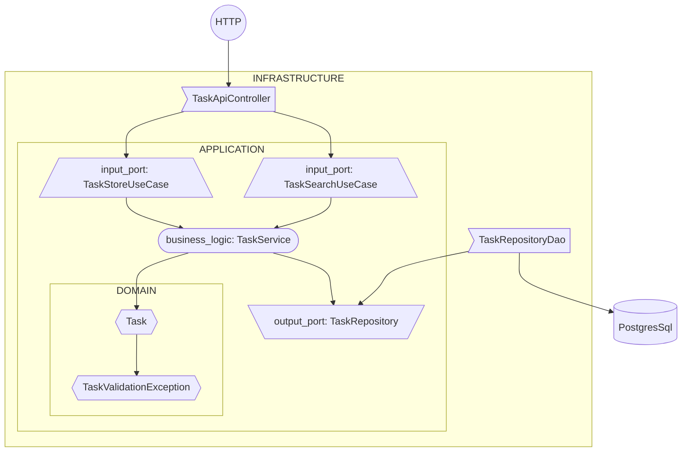

# Base template using Kotlin, Spring and Hexagonal architecture

[](https://github.com/diocorrea/base-kotlin-spring-postgres-template/actions/workflows/ci.yml) 
[](https://github.com/diocorrea/base-kotlin-spring-postgres-template/actions/workflows/ci.yml)
## Hexagonal Architecture

There are different ways to look for Hexagonal Architecture, if you search around you find multiple implementations and
interpretations of it.
This is my vision, maybe not so complex, on how to implement it, using Spring and Kotlin.
The core concept is to always depend inwards, where the external layers will always depends on the internal layers, and
never the other way around.
With this simple trick, we can isolate our business logic, in this diagram represented by the Application and Domain
layers, from frameworks, database implementation, transport layer, etc.



## Generating Jooq Files

To generate jooq files first deploy docker compose. It will start a Postgres database and will initiate Liquibase
migration.

````
docker-compose up
````

After Liquibase completed the migration, and while Postgres is still running, run the following command.

````
gralde generateJooq
````

That should generate all the needed files under the `src/main/java` package.
Jooq, only generates Java, so, unfortunately it will remain under that folder.

## Running tests

To run tests locally or to build the project you just need to execute gradle.

````
gralde build
or
gradle test
````
