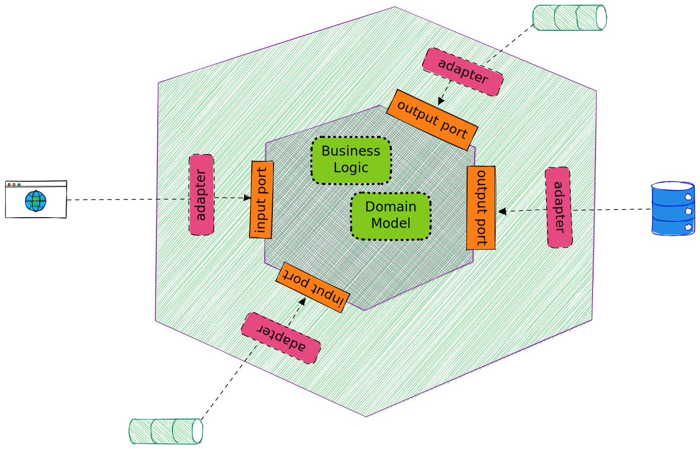
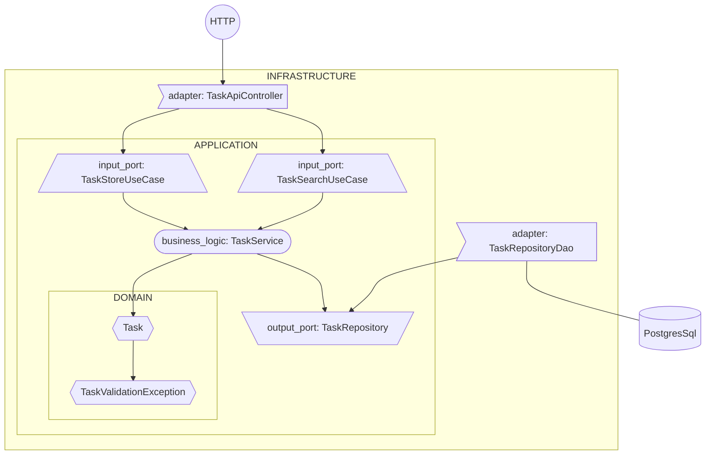

# Base template using Kotlin, Spring and Hexagonal architecture

[](https://github.com/diocorrea/base-kotlin-spring-postgres-template/actions/workflows/ci.yml) 
[](https://github.com/diocorrea/base-kotlin-spring-postgres-template/actions/workflows/ci.yml)

## Hexagonal Architecture

There are different ways to look for Hexagonal Architecture, if you search around you find multiple implementations and interpretations of it. <br/>
This is my approach, maybe not so complex, on how to implement it, using Spring and Kotlin.
The core concept is to always depend inwards, where the external layers will always depends on the internal layers, and never the other way around. <br/>
With this simple trick, we can isolate our business logic, in this diagram represented by the Application and Domain
layers, from frameworks, database implementation, transport layer, etc.

Bellow I'll go over some of the concepts, and what I think is the most important things to consider when talking about Hexagonal Architecture. 

### Ports & Adapters

As a high level, you can think about Ports as interfaces, that will guide your communications in and out of your application. They will abstract your business logic from all external interference and things that are not relevant. 

For instance, one use case, might be to do a simple store of an object, as in this case of a Task. But, our class that is dealing with the business logic of what is interesting about storing, retrieving and making sure the business is correct, does not care if the storage mechanism is a database, a file system or something else. Therefore, we can simple use the port, in that case TaskRepository, to abstract this logic. 

Same goes for the input layer, internal business logic, should and must not know specific behaviours of distinct transport layers, if a store use case is called from a Rest endpoint or from an event stream, it shouldn't know or care about it. So, that's why having the port on the input side is also important.

Adapters are the specific implementation, they give pourpose to the ports, for instance we have the RestAdapter or the DataBaseAdapter.
We can use some dependency injection framework like spring to make the binding of the layers.


[Original post from Dr. Alistair Cockburn](https://alistair.cockburn.us/hexagonal-architecture/) 




### Project diagram, with the main classes.


## Generating Jooq Files

To generate jooq files first deploy docker compose. It will start a Postgres database and will initiate Liquibase
migration.

````
docker-compose up
````

After Liquibase completed the migration, and while Postgres is still running, run the following command.

````
gradle generateJooq
````

That should generate all the needed files under the `src/main/java` package.
Jooq, only generates Java, so, unfortunately it will remain under that folder.

## Running tests

To run tests locally or to build the project you just need to execute gradle.

````
gradle build
or
gradle test
````

## Why using Liquibase?
Liquibase provides a way to evolve the database schema in a automated way, it keeps track of what was applied and makes the migration automatically. Differntly than other frameworks like Hibernate, it keeps track of every single step and not only the latest version, so it is possible to reproduce and roll back if needed. Plus you have a history out of the box of all the changes performed.

You must be caution though, in a CD environment you aware of breaking changes on the database, like including a new non-null column in an existing table. That could be potentially catastrophic, as code that is already running might not know about the knew constraint, and during the deployment you can enconter different versions of the application and database coexisting. Things can be even harder, if a roll back is needed. 

My tip is, always try to make retrocompatible changes, or break them into steps. For instance, in the example I gave before, you could first create the new column nullable, wait for all the nodes to be replaced with the new code, put some default value or back fill the empty ones, then enable the constraint. So you garantee that your code will not try to insert null into the column, and the Db is also clean and nice. This is just a silly example, but you'll face many of the sort on the wild.

## Why using jooq and not Hibernate / ORM?

There are several issues with using ORM that I encontered in my career, the most problematic one is around detaching objects. Detaching objects and transaction propagation is non trivial and can be misleading specially because it changes slitly its implementation if you go from J2EE to Spring, but the real issue is that people have a hard time to use it and can break it very easly. 

But, what does that mean exactly?

If you make a select, get the object, change an attribute of that object, you don't need to send a command to the data base, it is still attached (depending on your transaction level), so it will automagically update the table. With transaction propagation, that object can remain attached through many layers, yes I say some in the controller, and even in the JSF. IMHO that makes the system very unpredictable and can create issues that are extremely hard to debug. 

If you thought I was going to talk about the query performance and how Hibernate creates the N+1 problem, well people do that as well with native queries. But yeah, that's also a problem, not the biggest for me though.

So jooq for the rescue then? 

Jooq is quite simple, it generates a DSL that helps to parse the record set to Objects. It generates its own classes from the database, so that's a big plus, you don't need to do any kind of reflections. Unfortunately it only generates Java. I do not recommend autogenerate on the fly, generate it once commit and move on, you don't change db so often why would you loose so many precious minutes configuring your environment? 


## Why Spring?

You can use anything you prefer, Spring was my prefered choice here, I do enjoy working with it.

My personal list of benefits:
 * Spring has the biggest community out there
 * Easy to learn, easy to find someone to teach you, easy to find a blog post
 * It's very mature
 * Testability, many tools and different approachs for testing
 * New releases all the time, constant evolution
